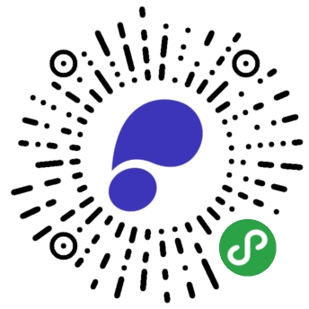

# 微信智聆口语测评小程序

微信智聆口语测评小程序是针对口语练习场景开发的测评类小程序，提供了句子和单词发音准确度等功能。

## 预览

## 下载与使用

1. 克隆代码
2. `project.config.json` 中的 `appid` 替换成在公众平台申请的项目 id
3. 在 `公众平台 → 设置 → 第三方服务 → 插件管理` 中 添加`智聆口语评测`插件 (`wx63d6102e26f0a3f8`)
4. 打开微信开发者工具中添加项目

## 微信版本要求

基础库版本 >= `1.9.94`

- 使用插件，需要基础库版本 >= `1.9.6`
- 插件内调用`wx.getRecorderManager`接口，需要基础库版本 >= `1.9.94`

## 智聆口语评测小程序插件支持功能

- 单词发音评估（输出结果包括 `音素准确度`, `单词准确度`, `流畅度`）
- 句子发音评估（输出结果包括 `单词准确度`, `句子完整度`, `流畅度`）

- 插件开发文档：[智聆口语评测小程序插件](https://mp.weixin.qq.com/wxopen/plugindevdoc?appid=wx63d6102e26f0a3f8&token=1947236119&lang=zh_CN)

## FAQ

对于插件有新需求，可描述具体使用场景发送邮件至`blakezhang@tencent.com`

## License

[The MIT License](./LICENSE.txt)

